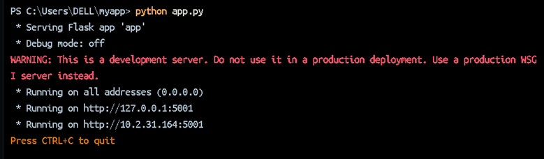
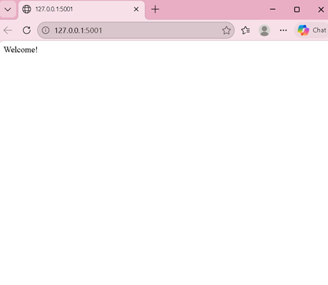
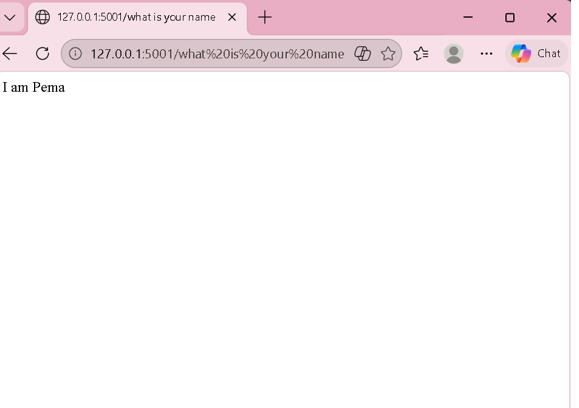
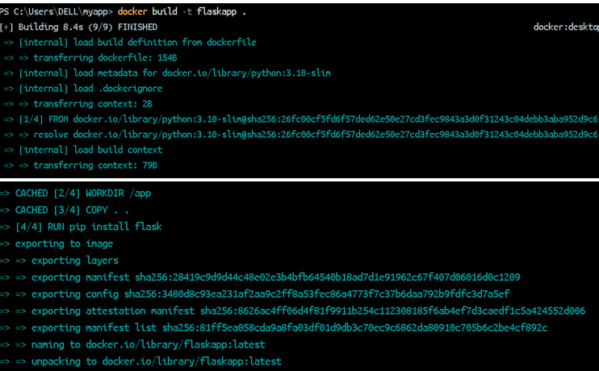
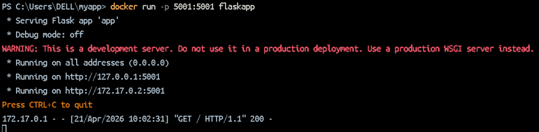

# Aim
To build a Docker image for a Flask web application and run it using Docker.

---

# Implementation Steps

## 1. Create Project Directory
A new working directory was created for the project using the following command:

```
mkdir -p ~/myapp
```

Then, the directory was accessed:

```
cd ~/myapp
```

---

## 2. Create Python Flask Application
A Python file named `add.py` was created inside the project folder.

---

## 3. Run Flask Application
The Flask application was executed, and it provided a local server link.

The application was accessed in the browser using:
```
http://127.0.0.1:5001/
```


It was also tested using:

```
http://127.0.0.1:5001/how-are-you
```

---

## 4. Test API Responses
The application initially returned:

- “I’m good, how about you?”

The code was then modified to change the response:

- “How are you?” → “What is your name?”  
- “I’m good, how about you?” → “I am Pema”

After updating the code, the browser showed the updated responses successfully.

---

## 5. Stop Flask Server
After testing, the Flask server was stopped.

---

## 6. Create Dockerfile
A Dockerfile was created using Notepad.

---

## 7. Build Docker Image
The Docker image was built using the command:


---

## 8. Run Docker Container
The container was run using:


---

# Conclusion
This practical helped in understanding how to create a simple Flask application, modify responses, and containerize the application using Docker. It also demonstrated how Docker can be used to run applications in an isolated environment.

