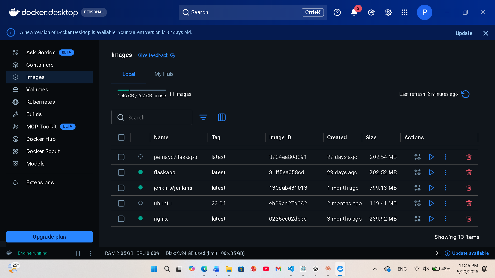
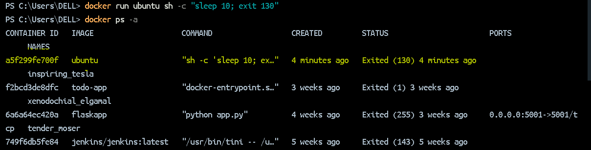
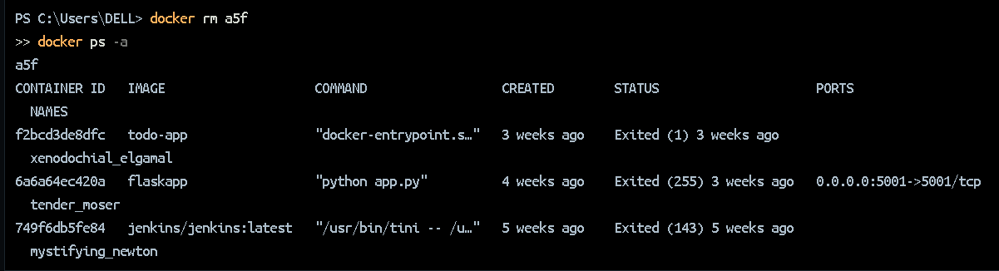
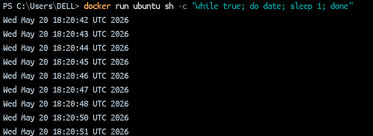
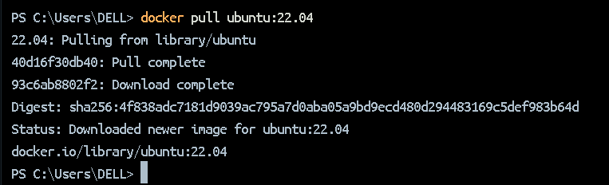
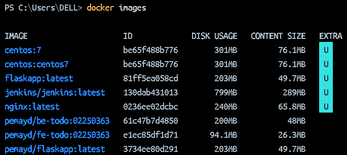
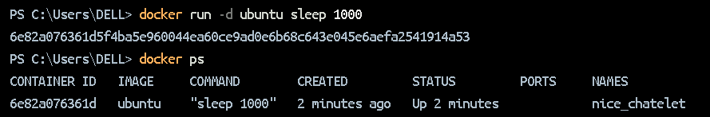
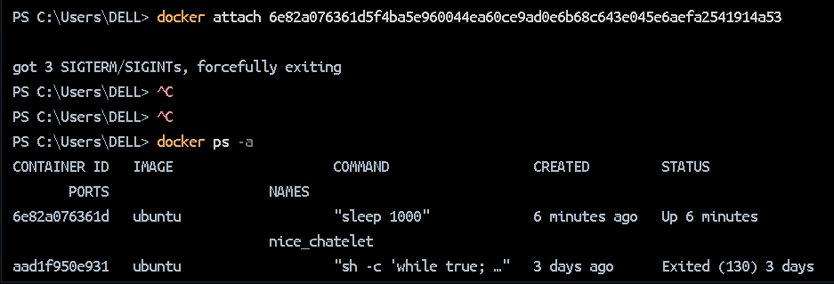

# Understanding Container Lifecycle and Image Management

# Aim
To explore Docker container lifecycle management — including running, stopping, attaching to, and removing containers — and to understand Docker image pulling and management.

# Implementation Steps

## 1. Verifying Docker is Running

Before any Docker commands could be executed, the Docker Desktop daemon needed to be running. An initial attempt failed with a connection error.

After starting Docker Desktop, the daemon connected successfully and `docker ps -a` returned the list of existing containers.

## 2. Viewing Existing Containers

The following command was used to list all containers, including stopped ones:

This showed several previously created containers in `Exited` status, including containers based on `centos:7`, `nginx`, and a custom `pemayd/be-todo` image.

## 3. Running a Container with an Exit Code

A new Ubuntu container was run with a command that sleeps for 10 seconds and then exits with code `130`:
' docker run ubuntu sh -c "sleep 10; exit 130" '

Since the `ubuntu:latest` image was not available locally, Docker automatically pulled it from Docker Hub. After the container exited, `docker ps -a` confirmed the container with status `Exited (130)`.

## 4. Removing a Stopped Container

The exited container was removed using a short-form container ID:
'docker rm a5f'

`docker ps -a` was run again to confirm the container was successfully removed.

## 5. Running a Long-Running Container (Foreground)

A container was run that continuously prints the current date every second:
' docker run ubuntu sh -c "while true; do date; sleep 1; done" '

This ran in the **foreground**, printing output directly to the terminal. The container was manually stopped with Ctrl+C, which caused it to exit with code `130`.

## 6. Pulling a Specific Image Version

A specific version of Ubuntu was pulled from Docker Hub:

The `docker images` command was used to view all locally available images:

This listed all pulled images including `centos:7`, `nginx`, `ubuntu:latest`, `ubuntu:22.04`, and others.

## 7. Running a Detached Container

A container was started in **detached (background)** mode using the `-d` flag:
'docker run -d ubuntu sleep 1000'

The command returned the full container ID. `docker ps` (without `-a`) confirmed the container was actively running.

## 8. Attaching to a Running Container

The `docker attach` command was used to connect to the running detached container:
docker attach 

Since the container was running `sleep 1000` (which produces no output), attaching showed a blank terminal. The connection was closed, which sent a termination signal to the container, causing it to stop with exit code `137`.

# Exit Code Reference

 0: Completed successfully 
 1: General error
 127: Command not found
 130: Terminated by Ctrl+C (SIGINT) 
 137: Force killed (SIGKILL)

# Conclusion

This practical demonstrated the core Docker container lifecycle — pulling images, running containers in both foreground and background modes, attaching to running containers, and removing stopped containers. It also showed how different exit codes reflect how a container was terminated. Understanding these fundamentals is essential for working with containerized applications.
